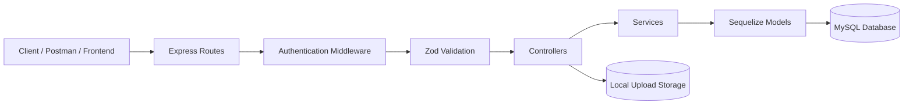
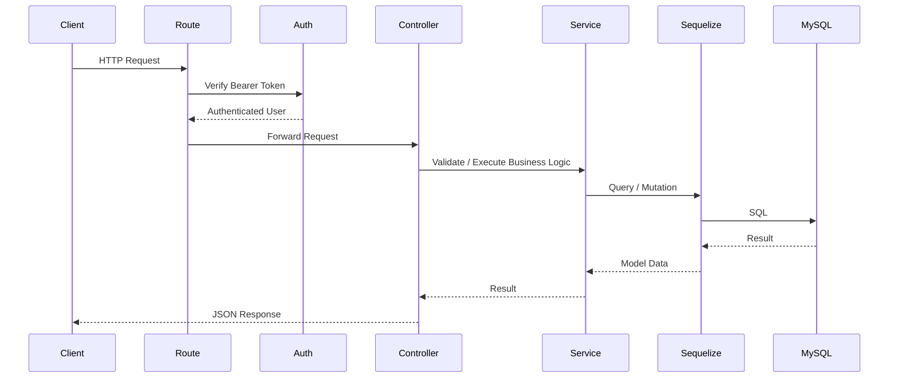
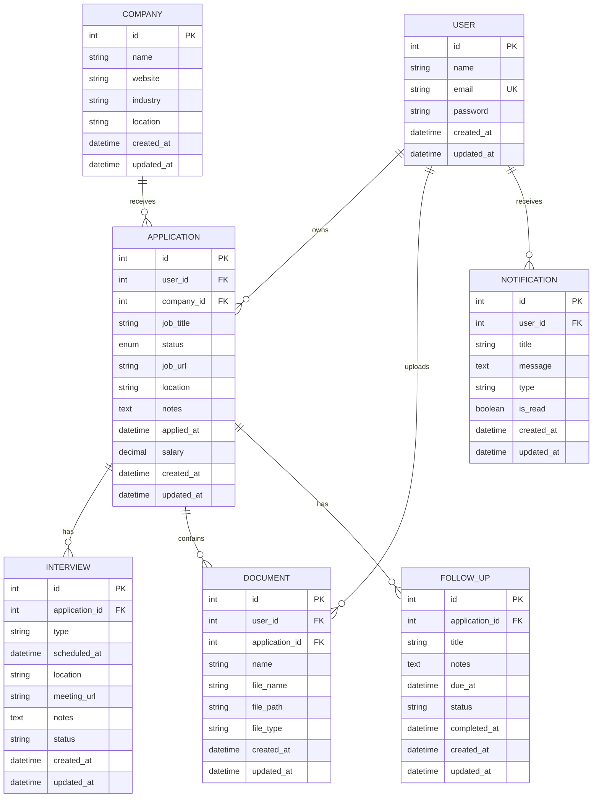
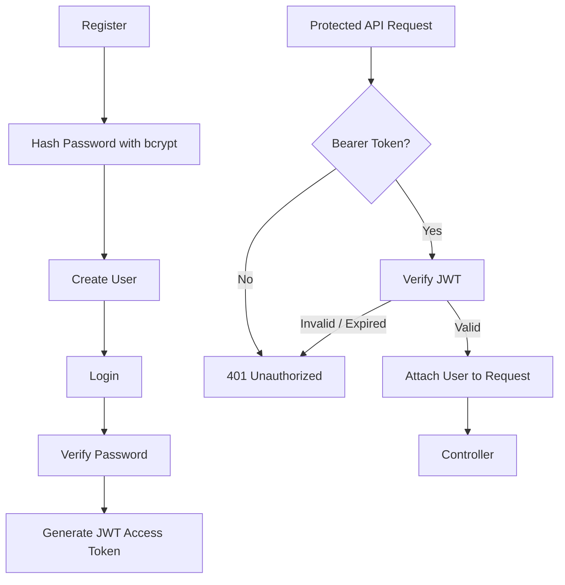
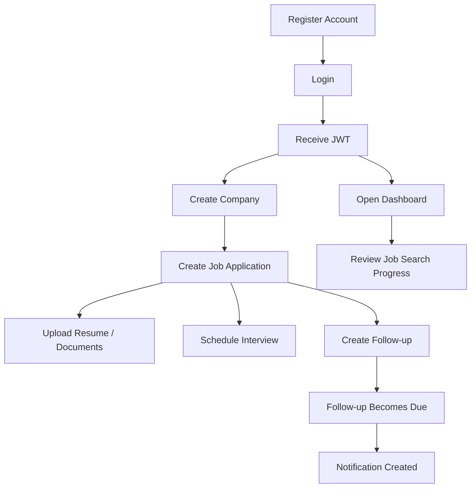

# Job Application Tracker API

<p align="center">
  <h1 align="center">Job Application Tracker</h1>
  <p align="center">
    A RESTful backend for organizing job applications, companies, interviews, follow-ups, documents, notifications, and application analytics.
  </p>
</p>

<p align="center">
  <a href="https://github.com/Aayushdai/job_application_tracker">
    
  </a>
  
  
  
  
  
</p>

---

## Overview

The **Job Application Tracker API** is a backend application designed to help job seekers manage the complete lifecycle of their job search from a single system.

Instead of keeping application information across spreadsheets, notes, calendars, and file folders, the API provides a centralized data model for:

- Job applications and their current status
- Companies and their details
- Interviews and interview schedules
- Follow-up tasks
- Resumes and other job-related documents
- User notifications
- Dashboard statistics and recent activity

The backend follows a layered structure where HTTP routes delegate work to controllers, services handle application logic, and Sequelize models communicate with MySQL.

---

## Why This Project?

A job search can quickly become difficult to manage when applications move through different stages and each company has different interview and follow-up requirements.

This project aims to make that workflow easier:

```text
                JOB SEARCH WORKFLOW

  Find Job
      │
      ▼
  Save Application
      │
      ▼
  Apply
      │
      ├──────────────► Track Status
      │
      ├──────────────► Upload Documents
      │
      ├──────────────► Schedule Interview
      │                      │
      │                      ▼
      │                Interview Result
      │
      └──────────────► Create Follow-up
                             │
                             ▼
                       Notification
```

---

## Features

| Area | Capability |
|---|---|
| Authentication | User registration and login with JWT access tokens |
| Applications | Create, view, update, and delete applications |
| Companies | Create, view, update, and delete companies |
| Interviews | Create and manage interviews for an application |
| Documents | Upload, retrieve, update metadata, download, and delete files |
| Follow-ups | Create and manage follow-up tasks associated with applications |
| Notifications | View, read, and delete notifications |
| Dashboard | Application counts, status distribution, interviews, offers, rejections, follow-ups, and recent applications |
| Validation | Request validation using Zod |
| Security | Helmet, CORS, JWT authentication, password hashing, and API rate limiting |
| Automation | Scheduled follow-up checks and notification cleanup |

---

## Architecture

The project uses a conventional layered REST API architecture.



### Request flow



---

## Data Model

The current database relationships are centered around the user's applications.



---

## Application Status Lifecycle

Applications support the following statuses:

```text
saved
  │
  ▼
applied
  │
  ▼
assessment
  │
  ▼
interview
  │
  ├──────────► rejected
  │
  ├──────────► withdrawn
  │
  ▼
offer
```

> `interview`, `offer`, `rejected`, and `withdrawn` represent states that can be reached according to the user's application progress. The API does not force a single linear transition path.

---

## Tech Stack

### Backend

| Technology | Purpose |
|---|---|
| Node.js | JavaScript runtime |
| Express 5 | REST API framework |
| Sequelize 6 | ORM and database access |
| MySQL2 | MySQL driver |
| MySQL | Relational database |
| Zod | Input validation |
| JSON Web Token | Authentication |
| bcrypt | Password hashing |
| Multer | File uploads |
| node-cron | Scheduled background jobs |
| Helmet | HTTP security headers |
| CORS | Cross-origin access control |
| express-rate-limit | API request rate limiting |
| dotenv | Environment variable management |
| nodemon | Development server reloads |

---

## Project Structure

```text
job_application_tracker/
│
├── migrations/
│   └── Database migration files
│
├── src/
│   ├── config/
│   │   ├── database.js          # Sequelize / MySQL connection
│   │   └── env.js               # Environment configuration
│   │
│   ├── controllers/
│   │   ├── auth.controller.js
│   │   ├── application.controller.js
│   │   ├── company.controller.js
│   │   ├── dashboard.controller.js
│   │   ├── document.controller.js
│   │   ├── followUp.controller.js
│   │   ├── interview.controller.js
│   │   └── notification.controller.js
│   │
│   ├── jobs/
│   │   ├── followUp.job.js      # Checks due follow-ups
│   │   └── notification.job.js  # Cleans old read notifications
│   │
│   ├── middleware/
│   │   ├── auth.middleware.js
│   │   ├── error.middleware.js
│   │   └── upload.middleware.js
│   │
│   ├── models/
│   │   ├── User.js
│   │   ├── Company.js
│   │   ├── Application.js
│   │   ├── Interview.js
│   │   ├── Document.js
│   │   ├── FollowUp.js
│   │   ├── Notification.js
│   │   └── index.js
│   │
│   ├── routes/
│   │   ├── auth.routes.js
│   │   ├── company.routes.js
│   │   ├── application.routes.js
│   │   ├── interview.routes.js
│   │   ├── document.routes.js
│   │   ├── followUp.routes.js
│   │   ├── notification.routes.js
│   │   └── dashboard.routes.js
│   │
│   ├── services/
│   │   ├── auth.service.js
│   │   ├── application.service.js
│   │   ├── company.service.js
│   │   ├── dashboard.service.js
│   │   ├── document.service.js
│   │   ├── followUp.service.js
│   │   ├── Interview.service.js
│   │   └── notification.service.js
│   │
│   ├── utils/
│   │   └── jwt.js
│   │
│   ├── validators/
│   │   ├── auth.validator.js
│   │   ├── application.validator.js
│   │   ├── company.validator.js
│   │   └── interview.validator.js
│   │
│   ├── app.js                    # Express application
│   └── server.js                 # Server entry point
│
├── .env.example
├── .gitignore
├── .sequelizerc
├── sequelize.config.cjs
├── package.json
├── package-lock.json
└── README.md
```

---

## API

Base URL:

```text
http://localhost:5000/api
```

### Health Check

| Method | Endpoint | Auth |
|---|---|---|
| GET | `/health` | No |

Example response:

```json
{
  "success": true,
  "message": "Job Application Tracker API is running"
}
```

---

### Authentication

| Method | Endpoint | Auth |
|---|---|---|
| POST | `/auth/register` | No |
| POST | `/auth/login` | No |

#### Register

```json
{
  "name": "Aayush",
  "email": "aayush@example.com",
  "password": "strongpassword"
}
```

#### Login

```json
{
  "email": "aayush@example.com",
  "password": "strongpassword"
}
```

The login response returns a user object and an `accessToken`.

Authenticated requests use:

```http
Authorization: Bearer <access-token>
```

---

### Companies

| Method | Endpoint | Purpose |
|---|---|---|
| POST | `/companies` | Create company |
| GET | `/companies` | List companies |
| GET | `/companies/:id` | Get company |
| PUT | `/companies/:id` | Update company |
| DELETE | `/companies/:id` | Delete company |

Example:

```json
{
  "name": "Example Corp",
  "website": "https://example.com",
  "industry": "Software",
  "location": "Kathmandu"
}
```

---

### Applications

| Method | Endpoint | Purpose |
|---|---|---|
| POST | `/applications` | Create application |
| GET | `/applications` | List current user's applications |
| GET | `/applications/:id` | Get application |
| PATCH | `/applications/:id` | Update application |
| DELETE | `/applications/:id` | Delete application |

Create request:

```json
{
  "companyId": 1,
  "jobTitle": "Backend Developer",
  "status": "applied",
  "jobUrl": "https://example.com/jobs/backend-developer",
  "location": "Kathmandu",
  "notes": "Applied through company website",
  "appliedAt": "2026-10-01T10:00:00.000Z",
  "salary": 80000
}
```

Supported application statuses:

```text
saved
applied
assessment
interview
offer
rejected
withdrawn
```

---

### Interviews

Interview records belong to an application.

| Method | Endpoint | Purpose |
|---|---|---|
| POST | `/interviews/:applicationId` | Create interview |
| GET | `/interviews/:applicationId` | List interviews |
| GET | `/interviews/:applicationId/:id` | Get interview |
| PATCH | `/interviews/:applicationId/:id` | Update interview |
| DELETE | `/interviews/:applicationId/:id` | Delete interview |

Supported interview types:

```text
phone
technical
behavioral
hr
final
other
```

Supported interview statuses:

```text
scheduled
completed
cancelled
```

Example request:

```json
{
  "type": "technical",
  "scheduledAt": "2026-10-05T09:00:00.000Z",
  "location": "Kathmandu",
  "meetingUrl": "https://meet.example.com/interview",
  "notes": "Prepare backend and database questions",
  "status": "scheduled"
}
```

---

### Documents

Documents can be uploaded to the local `uploads/` directory and optionally associated with an application.

| Method | Endpoint | Purpose |
|---|---|---|
| POST | `/documents` | Upload document |
| GET | `/documents` | List current user's documents |
| GET | `/documents/:id` | Get document |
| GET | `/documents/:id/download` | Download file |
| PATCH | `/documents/:id` | Update document metadata |
| DELETE | `/documents/:id` | Delete document |

Upload requests use:

```text
Content-Type: multipart/form-data
```

Form fields:

```text
name
applicationId   (optional)
file
```

---

### Follow-ups

Follow-ups are tasks associated with an application.

| Method | Endpoint | Purpose |
|---|---|---|
| POST | `/follow-ups/:applicationId` | Create follow-up |
| GET | `/follow-ups/:applicationId` | Get follow-ups |
| GET | `/follow-ups/:applicationId/:id` | Get follow-up |
| PATCH | `/follow-ups/:applicationId/:id` | Update follow-up |
| DELETE | `/follow-ups/:applicationId/:id` | Delete follow-up |

A follow-up contains information such as:

```json
{
  "applicationId": 1,
  "title": "Send recruiter follow-up email",
  "notes": "Follow up after one week",
  "dueAt": "2026-10-08T09:00:00.000Z",
  "status": "pending"
}
```

---

### Notifications

| Method | Endpoint | Purpose |
|---|---|---|
| GET | `/notifications` | List notifications |
| GET | `/notifications/:notificationId` | Get notification |
| PATCH | `/notifications/:id/read` | Mark as read |
| DELETE | `/notifications/:id` | Delete notification |

---

### Dashboard

| Method | Endpoint | Purpose |
|---|---|---|
| GET | `/dashboard` | Get dashboard summary |

The dashboard provides:

```text
Total applications
Total interviews
Total offers
Total rejections
Applications by status
Upcoming interviews
Pending follow-ups
Recent applications
```

---

## Authentication Flow



The JWT currently contains:

```json
{
  "id": 1,
  "email": "aayush@example.com"
}
```

---

## Scheduled Jobs

The backend starts two scheduled jobs when the server starts.

### Follow-up checker

Runs every minute and checks pending follow-ups.

```text
Every minute
     │
     ▼
Find pending follow-ups
     │
     ▼
Check due_at
     │
     ├── Not due ───────► Ignore
     │
     └── Due
          │
          ▼
      Create notification
```

Duplicate follow-up notifications are avoided by checking for an existing matching notification.

### Notification cleanup

Runs at the start of every hour and removes notifications that are:

```text
is_read = true
AND
created more than 30 days ago
```

---

## Validation

Request validation is handled using **Zod**.

Examples:

### User

```text
name      → minimum 2 characters
email     → valid email address
password  → minimum 8 characters
```

### Application

```text
companyId → positive integer
jobTitle  → minimum 2 characters
jobUrl    → valid URL when provided
salary    → non-negative number when provided
```

### Interview

```text
type         → predefined interview type
scheduledAt  → ISO datetime
meetingUrl   → valid URL when provided
status       → scheduled | completed | cancelled
```

Validation errors are passed through the application's error-handling middleware.

---

## Security

The API includes several basic security measures:

- Password hashing with `bcrypt`
- JWT-based authentication
- Protected application routes
- Helmet security headers
- CORS middleware
- Rate limiting under `/api`
- Environment variables for secrets and database credentials
- `.env` excluded from Git
- `uploads/` excluded from Git

> This is a development-stage API. Production deployments should add stronger validation of uploaded file types and sizes, centralized secret management, HTTPS, stricter CORS rules, structured logging, and additional authorization checks.

---

## Installation

### 1. Clone the repository

```bash
git clone https://github.com/Aayushdai/job_application_tracker.git
cd job_application_tracker
```

### 2. Install dependencies

```bash
npm install
```

### 3. Create the database

Using MySQL:

```sql
CREATE DATABASE job_tracker;
```

### 4. Create environment variables

Create a `.env` file in the project root.

```env
PORT=5000

DB_HOST=localhost
DB_PORT=3306
DB_NAME=job_tracker
DB_USER=root
DB_PASSWORD=your_mysql_password

JWT_SECRET=your_access_token_secret
JWT_EXPIRES_IN=55m

JWT_REFRESH_SECRET=your_refresh_secret
JWT_REFRESH_EXPIRES_IN=7d
```

### 5. Run migrations

```bash
npm run migrate
```

### 6. Start the development server

```bash
npm run dev
```

Or run normally:

```bash
npm start
```

The API will be available at:

```text
http://localhost:5000
```

Health check:

```text
GET http://localhost:5000/api/health
```

---

## Environment Variables

| Variable | Purpose |
|---|---|
| `PORT` | Express server port |
| `DB_HOST` | MySQL host |
| `DB_PORT` | MySQL port |
| `DB_NAME` | Database name |
| `DB_USER` | Database username |
| `DB_PASSWORD` | Database password |
| `JWT_SECRET` | Access-token signing secret |
| `JWT_EXPIRES_IN` | Access-token lifetime |
| `JWT_REFRESH_SECRET` | Refresh-token secret configuration |
| `JWT_REFRESH_EXPIRES_IN` | Refresh-token lifetime configuration |

> **Important:** the current Sequelize configuration uses the MySQL dialect. Make sure your `.env` uses MySQL settings (`DB_PORT=3306` in a standard local setup). The committed `.env.example` still contains PostgreSQL-style defaults and should be updated to match the MySQL configuration.

---

## NPM Scripts

```bash
npm run dev
```

Starts the server with Nodemon.

```bash
npm start
```

Starts the server with Node.js.

```bash
npm run migrate
```

Runs Sequelize database migrations.

---

## Error Handling

The API uses a centralized error middleware.

Common application errors include:

```text
404  Company not found
404  Application not found
404  Interview not found
404  Document not found
404  Follow-up not found
404  Notification not found

409  Email is already registered

500  Internal server error
```

Authentication failures return:

```json
{
  "success": false,
  "message": "Invalid or expired token"
}
```

---

## Example API Workflow



---

## Development Notes

### Current implementation observations

This repository is actively developed. A few areas should be aligned as the project evolves:

1. **Environment template**
   - `sequelize.config.cjs` uses MySQL.
   - `.env.example` still uses PostgreSQL-style defaults.
   - Use the MySQL example shown in this README for local setup.

2. **Refresh-token configuration**
   - Refresh-token environment variables are present.
   - The current login service returns an access token; a full refresh-token endpoint/flow is not documented as implemented here.

3. **Follow-up API**
   - Follow-up routes are nested under an `applicationId`.
   - The current service layer also expects application information in request data in some operations.
   - Keep the route, controller, and service contracts synchronized when extending this module.

4. **Interview deletion**
   - The interview delete controller currently needs a small variable fix before that endpoint should be treated as production-ready.

These notes are intentionally included so the README describes the repository honestly rather than documenting behavior that is not yet reliable.

---

## Roadmap

Possible next improvements:

- [ ] Refresh-token authentication flow
- [ ] Swagger / OpenAPI documentation
- [ ] Automated unit and integration tests
- [ ] Better file validation and upload limits
- [ ] Pagination and filtering for applications
- [ ] Application activity/history tracking
- [ ] Email or external notification delivery
- [ ] Calendar integration
- [ ] More advanced dashboard analytics
- [ ] Docker setup
- [ ] Production deployment configuration
- [ ] CI/CD with GitHub Actions

---

## API Design Principles

The backend is organized around a few simple principles:

```text
Routes
  ↓
Controllers
  ↓
Services
  ↓
Models / Sequelize
  ↓
MySQL
```

### Routes
Define HTTP endpoints and middleware.

### Controllers
Handle HTTP requests and responses.

### Services
Contain business logic and database operations.

### Models
Define the application's persistent data structures and relationships.

### Middleware
Handles cross-cutting behavior such as authentication, uploads, rate limiting, and error processing.

This separation keeps the code easier to extend as new features are added.

---

## Project Status

**Status:** Active development

The current backend already provides the core pieces of a personal job-search management system:

```text
Authentication
     +
Applications
     +
Companies
     +
Interviews
     +
Documents
     +
Follow-ups
     +
Notifications
     +
Dashboard
     =
Job Application Tracker API
```

---

## Author

**Aayush Poudel**

GitHub: [@Aayushdai](https://github.com/Aayushdai)

Repository: [Aayushdai/job_application_tracker](https://github.com/Aayushdai/job_application_tracker)

---

## License

This project currently uses the license configuration defined in `package.json`.

